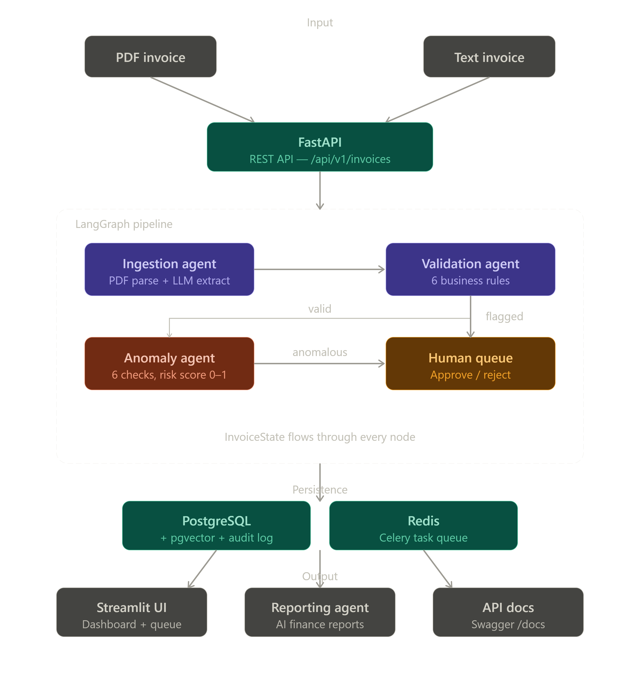

# FinAgent 🤖

> Autonomous Finance Operations — Multi-Agent Invoice Processing Platform

FinAgent automates enterprise invoice processing using orchestrated AI agents — cutting processing costs by 80%, detecting fraud patterns humans miss, and giving finance teams real-time visibility into their spending.

---

## Problem Statement

Accounts Payable teams in mid-to-large enterprises process hundreds of invoices monthly — manually. This is:

- **Costly** — $12–15 per invoice to process manually
- **Slow** — 4–16 days average processing time
- **Error-prone** — 1 in 10 invoices contains an error
- **Fraud-vulnerable** — duplicate payments cost businesses $280B annually

FinAgent solves this with autonomous AI agents that process invoices in minutes, detect fraud patterns automatically, and only involve humans when truly necessary.

---

## Architecture



---

## Agent Pipeline

| Agent | Role | Key Features |
|---|---|---|
| **Ingestion Agent** | Reads invoices | PDF parsing, LLM extraction, structured output |
| **Validation Agent** | Checks business rules | Vendor registry, duplicate detection, 6 rules |
| **Anomaly Agent** | Detects patterns | 6 checks, risk scoring 0.0–1.0 |
| **Reporting Agent** | Generates insights | SQL aggregations, LLM narrative, charts |

---

## Tech Stack

| Layer | Technology |
|---|---|
| Agent Orchestration | LangGraph |
| Backend API | FastAPI + Python 3.12 |
| Database | PostgreSQL + pgvector |
| LLM (dev) | Groq — Llama 3.3 70B (free) |
| LLM (demo) | Anthropic Claude Sonnet |
| PDF Processing | PyMuPDF |
| Dashboard | Streamlit |
| Containerization | Docker Compose |

---

## Key Features

- **Multi-agent orchestration** — LangGraph stateful graph with conditional routing
- **6 validation rules** — vendor registry, duplicate detection, amount validation
- **6 anomaly checks** — amount spikes, velocity, duplicate amounts, round numbers
- **Human-in-the-loop** — flagged invoices routed to approval queue automatically
- **Full audit trail** — every agent decision logged with reasoning
- **Real-time dashboard** — Streamlit UI for queue management and reporting
- **Swappable LLM** — switch between Groq, Ollama, and Claude via .env

---

## Quick Start

### 1. Clone and setup

```bash
git clone https://github.com/yourusername/finagent.git
cd finagent
cp .env.example .env
python -m venv venv && source venv/bin/activate
pip install -r requirements.txt
```

### 2. Configure environment

Edit `.env` and add your Groq API key:
```
LLM_PROVIDER=groq
GROQ_API_KEY=your-groq-api-key
GROQ_MODEL=llama-3.3-70b-versatile
```

### 3. Start infrastructure

```bash
docker compose up -d
```

### 4. Run the API

```bash
uvicorn backend.main:app --reload
```

### 5. Run the dashboard

```bash
streamlit run frontend/app.py
```

### 6. Seed demo data

```bash
python scripts/seed_data.py
```

---

## API Endpoints

```
POST /api/v1/invoices/upload     → Upload PDF invoice
POST /api/v1/invoices/text       → Submit text invoice
GET  /api/v1/invoices/           → List all invoices

POST /api/v1/vendors/            → Register vendor
GET  /api/v1/vendors/            → List vendors
PATCH /api/v1/vendors/{id}       → Update/verify vendor

GET  /api/v1/queue/              → Get approval queue
POST /api/v1/queue/{id}/approve  → Approve invoice
POST /api/v1/queue/{id}/reject   → Reject invoice
GET  /api/v1/queue/stats/summary → Queue statistics

GET  /api/v1/reports/monthly     → Generate finance report
```

Full interactive docs: `http://localhost:8000/docs`

---

## Project Structure

```
finagent/
├── backend/
│   ├── agents/
│   │   ├── state.py              # LangGraph state definition
│   │   ├── graph.py              # Agent orchestration pipeline
│   │   ├── ingestion_agent.py    # PDF/text extraction
│   │   ├── validation_agent.py   # Business rule validation
│   │   ├── anomaly_agent.py      # Pattern detection
│   │   └── reporting_agent.py    # Finance report generation
│   ├── api/routes/               # FastAPI endpoints
│   ├── db/models/                # SQLAlchemy models
│   ├── services/                 # LLM, PDF, Celery services
│   └── main.py                   # Application entry point
├── frontend/
│   └── app.py                    # Streamlit dashboard
├── scripts/
│   └── seed_data.py              # Demo data seeder
└── docker-compose.yml            # PostgreSQL + Redis
```

---

## Anomaly Detection

The anomaly agent runs 6 independent checks with a cumulative risk score:

| Check | Score Weight | Triggers When |
|---|---|---|
| Amount Spike | +0.30 | Invoice 2x above vendor average |
| Duplicate Amount | +0.35 | Same amount from vendor in 30 days |
| New Vendor Large Amount | +0.40 | First invoice above $10,000 |
| High Velocity | +0.25 | 5+ invoices from vendor in 7 days |
| Round Number | +0.10 | Amount divisible by $1,000 |
| Off Hours | +0.10 | Submitted outside business hours |

Invoices scoring **≥ 0.5** are automatically flagged for human review.

---

